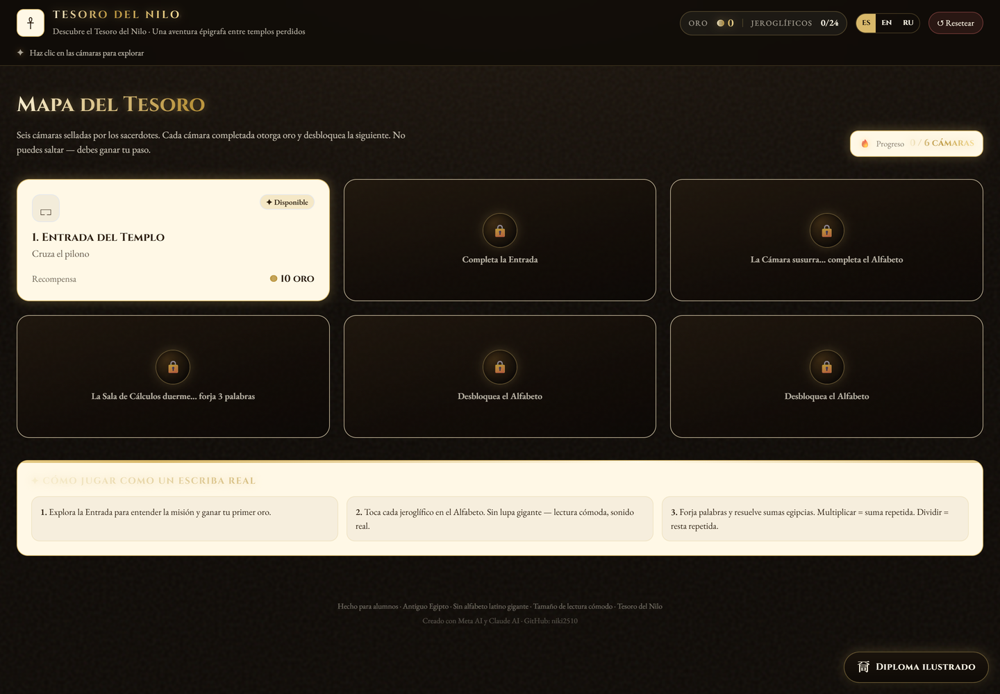
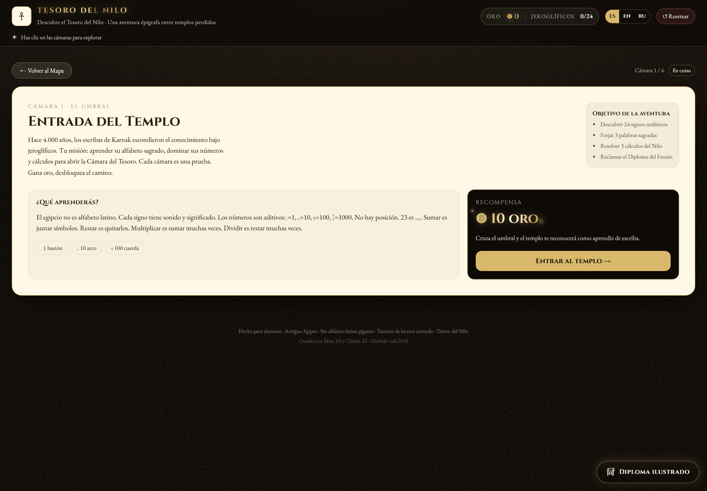
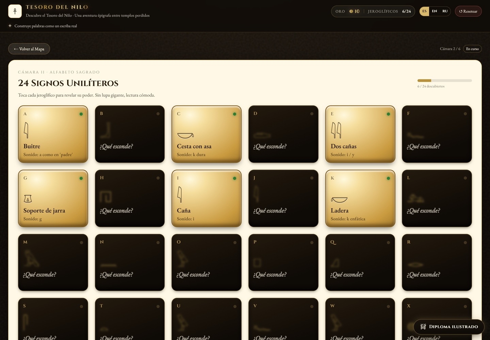
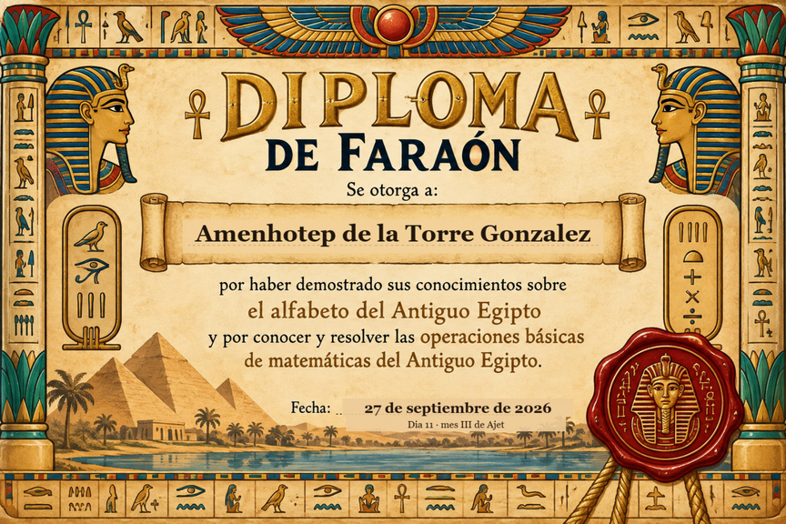

# 🏺 Tesoro del Nilo

**Una aventura interactiva para aprender el abecedario jeroglífico y las matemáticas del Antiguo Egipto.**

Juega directamente en el navegador, sin instalación: recorre seis cámaras selladas por los sacerdotes de Karnak, descubre los 24 signos unilíteros del alfabeto egipcio, forja palabras sagradas, resuelve cálculos con el sistema numérico egipcio (aditivo, sin posición) y reclama tu **Diploma del Faraón** ilustrado al terminar.

## 🎮 Cómo jugarlo

No necesita instalación ni servidor: es una única página HTML autocontenida.

1. Descarga o clona este repositorio.
2. Abre [`index.html`](index.html) en tu navegador (Chrome, Edge o Firefox).
3. Sigue el Mapa del Tesoro: cada cámara completada da oro y desbloquea la siguiente.

También incluye [`diploma-faraon.html`](diploma-faraon.html): una versión independiente del diploma ilustrado, por si solo quieres generar el certificado en PDF con nombre, apellidos y fecha.

## 📸 Capturas del juego

**Mapa del Tesoro** — seis cámaras selladas, cada una con su propia recompensa en oro:

**Cámara I · Entrada del Templo** — introduce la misión y el sistema numérico egipcio:

**Cámara II · Alfabeto Sagrado** — los 24 signos unilíteros, revelados uno a uno con su sonido:

**Diploma del Faraón** — el certificado ilustrado final, descargable en PDF:

## 📚 Por qué este juego es útil para aprender

Este proyecto nació con una idea sencilla: acercar la historia del Antiguo Egipto —su escritura y sus matemáticas— de una forma que motive de verdad a estudiar, en lugar de memorizar datos sueltos.

- **Alfabeto jeroglífico real**: se trabaja con los 24 signos unilíteros auténticos (transliteración egiptológica), no un alfabeto latino disfrazado. Aprender un sistema de escritura distinto al propio entrena la memoria visual, la asociación sonido-símbolo y la capacidad de reconocer patrones, habilidades que se transfieren directamente a la lectoescritura y al aprendizaje de idiomas.
- **Matemáticas egipcias aplicadas**: el sistema numérico egipcio es aditivo y sin valor posicional (23 no se escribe como "2" y "3", sino como la suma de sus símbolos). Multiplicar se resuelve como suma repetida y dividir como resta repetida. Entender *por qué* funciona un sistema numérico distinto al decimal ayuda a comprender mejor el propio: refuerza el sentido numérico, el cálculo mental y el razonamiento lógico de un modo mucho más profundo que repetir tablas de memoria.
- **Aprender historia haciendo, no leyendo**: en vez de un texto plano sobre el Antiguo Egipto, el jugador construye palabras, resuelve cálculos y gana recompensas —el aprendizaje activo (learning by doing) es consistentemente más efectivo que la lectura pasiva para fijar conocimiento a largo plazo.
- **Motivación para las nuevas generaciones**: convertir historia y matemáticas en una aventura con objetivos claros, progreso visible y un diploma final abre la puerta a que estudiantes jóvenes se interesen por asignaturas que a menudo perciben como áridas. Ese interés temprano —por la historia antigua, por las matemáticas, por entender cómo pensaban otras civilizaciones— es exactamente el tipo de motivación que después se traduce en mejores decisiones académicas y, con ello, en más oportunidades de futuro.

En definitiva: no es solo un juego sobre el Antiguo Egipto, es una herramienta pensada para que estudiar historia y matemáticas se sienta como una exploración, no como una obligación.

## 🛠️ Detalles técnicos

- Aplicación 100% en el cliente (React, sin backend), exportada como una única página HTML.
- Soporte multi-idioma (español, inglés, ruso).
- Generación de diploma en PDF sin dependencias de impresión del sistema operativo (funciona igual en escritorio y en Android).
- Progreso guardado localmente en el navegador.

---

*Hecho para alumnos · Antiguo Egipto · Tesoro del Nilo.*
