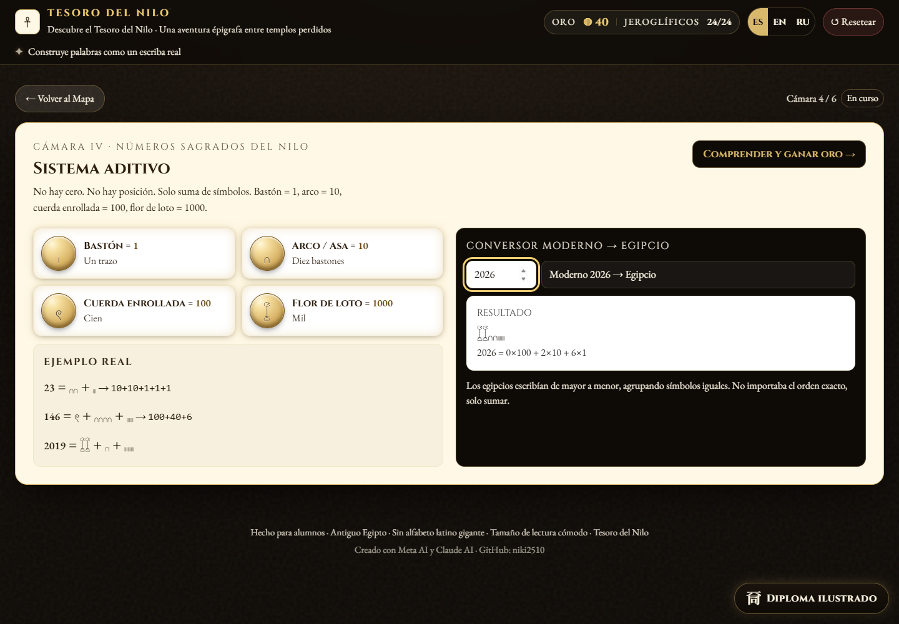
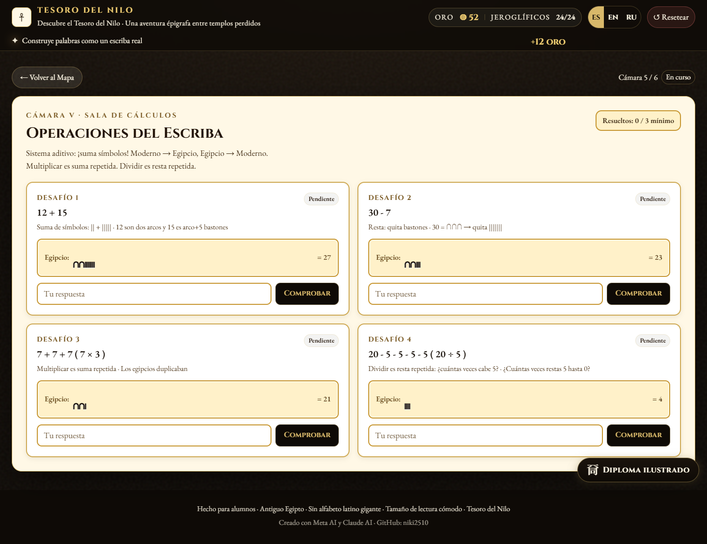

# Tesoro del Nilo

Aventura educativa interactiva para descubrir la escritura, los números y las operaciones matemáticas del Antiguo Egipto.

## Cómo abrirla

Descarga el repositorio y abre [`DOC-20260925-WA0002.htm`](DOC-20260925-WA0002.htm) en un navegador moderno. No requiere instalación.

Para practicar en profundidad la multiplicación y la división egipcias (método de duplicación, paso a paso, con comparación al cálculo moderno), abre [`multiplicacion-division-egipcias.html`](multiplicacion-division-egipcias.html).

## Capturas

### Números sagrados del Nilo

La cámara explica el sistema numérico aditivo egipcio y permite convertir números modernos en jeroglíficos.

### Operaciones matemáticas

La sala de cálculos presenta suma, resta, multiplicación y división mediante símbolos egipcios.

### Diploma del faraón

Al completar las seis cámaras se puede personalizar y descargar el diploma final.

## Contenido educativo

- 24 signos unilíteros con sonido y significado.
- Conversión de palabras modernas a su forma jeroglífica.
- Sistema numérico egipcio: 1, 10, 100 y 1000.
- Ejercicios de suma, resta, multiplicación y división.
- Interfaz en español, inglés y ruso.
- Diploma final descargable en PDF.
